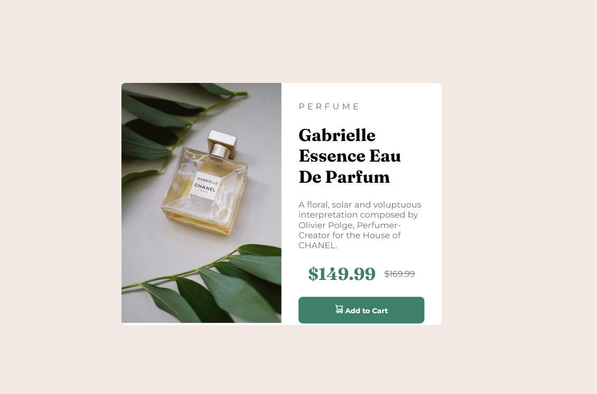
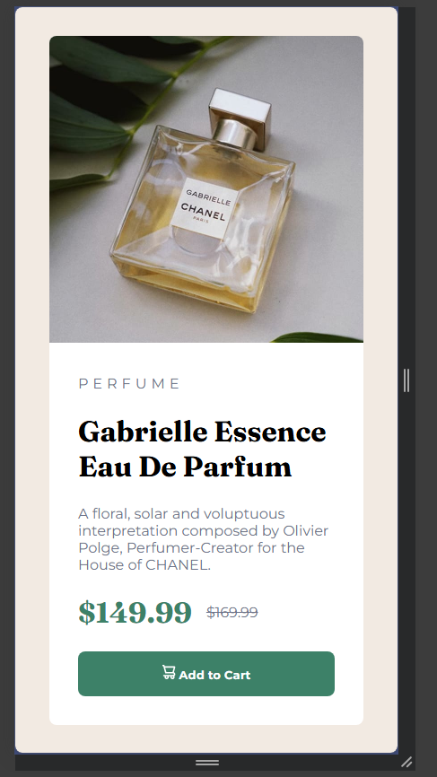

# Frontend Mentor - Recipe page solution

This is a solution to the [Recipe page challenge on Frontend Mentor](https://www.frontendmentor.io/challenges/recipe-page-KiTsR8QQKm). Frontend Mentor challenges help you improve your coding skills by building realistic projects. 

## Table of contents

- [Overview](#overview)
  - [The challenge](#the-challenge)
  - [Screenshot](#screenshot)
  - [Links](#links)
- [My process](#my-process)
  - [Built with](#built-with)
  - [What I learned](#what-i-learned)
  - [Continued development](#continued-development)
  - [Useful resources](#useful-resources)
  - [AI Collaboration](#ai-collaboration)
- [Author](#author)
- [Acknowledgments](#acknowledgments)

**Note: Delete this note and update the table of contents based on what sections you keep.**

## Overview

### Screenshot

### Links

- Solution URL: [Here](https://www.frontendmentor.io/learning-paths/getting-started-on-frontend-mentor-XJhRWRREZd/challenge/65e6f48617e502f0b6ca3d02/refactor)
- Live Site URL: [Here](https://jonasmdr.github.io/Product-preview-card-component/)

## My process

### Built with

- Semantic HTML5 markup
- CSS custom properties
- Flexbox

### What I learned

I managed to get a good grasp of Flexbox and how to position boxes on the screen, and I discovered some tags that helped with styling.

### Continued development

I’m going to keep deepening my knowledge of HTML, CSS, and JavaScript; even though these challenges don't include JS yet, I’m continuing to study it to gain a better, more in-depth understanding.

### AI Collaboration

- Gemini
- I used it to identify a positioning issue with an element in the mobile version.

## Author

- Frontend Mentor - [@jonasmdr](https://www.frontendmentor.io/profile/jonasmdr)
- Instagram - [jonasrocha60](https://www.instagram.com/jonasrocha60/)
